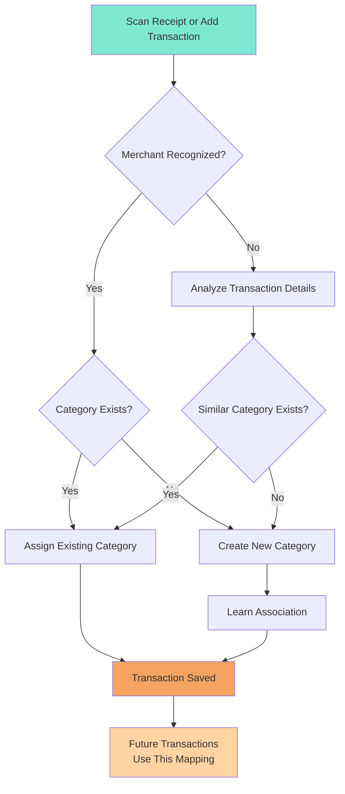

# Categories

Categories help you organize and analyze your transactions. Learn how to use and customize them.

## What are Categories?

Categories are labels that classify your transactions, making it easy to see where your money goes.

### Why Use Categories?

- **Organization** - Group similar transactions
- **Analysis** - See spending by category
- **Insights** - Identify spending patterns
- **Budgeting** - Track specific areas

## How Categories Work

### Smart Category Matching

When you scan a receipt or add a transaction, the AI automatically handles categorization:

**How it works:**

1. **Merchant Recognition** - AI identifies the merchant from receipt or transaction
2. **Category Matching** - Checks if a matching category already exists
3. **Smart Creation** - Creates a new category if needed (e.g., "Starbucks" → "Coffee")
4. **Learning** - Remembers the merchant-to-category association
5. **Future Use** - Next time you visit the same merchant, category is auto-assigned

**Example:** Scan a Starbucks receipt → AI creates "Coffee" category → Future Starbucks receipts automatically use "Coffee"

### Common Categories

The app intelligently creates categories based on your spending, such as:

**Expense Categories:**
- Food & Dining, Coffee, Groceries
- Transportation, Gas, Parking
- Shopping, Clothing, Electronics
- Entertainment, Movies, Streaming
- Bills & Utilities
- Healthcare, Pharmacy
- And many more based on your transactions

**Income Categories:**
- Salary, Freelance, Refunds
- Gifts Received, Investments
- Other Income

Categories are created automatically as you use the app - no manual setup required!

## Creating Custom Categories

### Add a Category

1. Go to Categories section
2. Tap "Add Category" or + button
3. Enter category name
4. Choose a color
5. Select an icon (if available)
6. Choose type (Income/Expense)
7. Tap Save

### Naming Tips

- **Be specific** - "Coffee" vs "Food & Dining"
- **Keep it short** - Easier to read
- **Use consistently** - Same name each time
- **Avoid duplicates** - Check existing categories

### Color Selection

Colors help you quickly identify categories:

- Choose distinct colors
- Use similar colors for related categories
- Consider color-blind friendly options
- Match your personal preference

## Editing Categories

### Modify Existing

To change a category:

1. Go to Categories section
2. Tap the category to edit
3. Change name, color, or icon
4. Tap Save

### What Happens to Transactions?

When you edit a category:

- All transactions with that category update automatically
- Historical data remains intact
- Analysis reflects the changes

## Deleting Categories

### Remove a Category

1. Go to Categories section
2. Swipe left on category (or tap edit)
3. Tap Delete
4. Confirm deletion

### What Happens to Transactions?

When you delete a category:

- Transactions move to "Uncategorized"
- You can reassign them to another category
- No transaction data is lost

!!! warning "Cannot Delete Default"
    The "Uncategorized" category cannot be deleted.

## Organizing Categories

### Reorder Categories

To change category order:

1. Go to Categories section
2. Enter edit mode
3. Drag categories to reorder
4. Tap Done

### Why Reorder?

- Put frequently used categories at top
- Group related categories together
- Match your workflow

## Category Best Practices

### Start Simple

- Use default categories first
- Add custom ones as needed
- Don't create too many

### Be Consistent

- Use same category for similar transactions
- Don't create near-duplicates
- Review and consolidate periodically

### Review Regularly

- Check if categories still make sense
- Merge similar categories
- Delete unused categories
- Adjust as spending habits change

## Category Strategies

### Minimal Approach

Keep it simple with few categories:

- Food
- Transport
- Shopping
- Bills
- Other

**Pros**: Fast categorization, simple analysis
**Cons**: Less detailed insights

### Detailed Approach

Many specific categories:

- Groceries
- Restaurants
- Coffee
- Fast Food
- Gas
- Public Transit
- Uber/Lyft
- Clothing
- Electronics
- Home Goods

**Pros**: Detailed insights, precise tracking
**Cons**: More time to categorize, complex analysis

### Balanced Approach

Mix of broad and specific:

- Food & Dining (broad)
  - Coffee (specific if you track it)
- Transportation (broad)
- Shopping (broad)
  - Electronics (specific for big purchases)
- Bills & Utilities (broad)

**Pros**: Good detail without complexity
**Cons**: Requires some thought

## Category Analysis

### View by Category

See spending breakdown:

1. Go to Analysis tab
2. View chart by category
3. See percentage of total
4. Identify top categories

### Category Insights

Look for:

- **Highest spending** - Where most money goes
- **Unexpected amounts** - Categories higher than expected
- **Trends** - Categories growing over time
- **Opportunities** - Areas to reduce spending

## Advanced Tips

### Subcategories

Money In & Out doesn't have subcategories, but you can simulate them:

- Use naming: "Food - Groceries", "Food - Restaurants"
- Use notes: Category "Food", Note "Groceries"
- Create separate categories: "Groceries", "Restaurants"

### Seasonal Categories

For occasional expenses:

- Create category when needed
- Use throughout season
- Keep for next year
- Examples: "Holiday Gifts", "Tax Prep", "Summer Travel"

### Project Tracking

Track specific projects:

- Create temporary category
- Use for all project expenses
- Review total at end
- Delete or archive when done

### Business vs Personal

If tracking both:

- Prefix categories: "Biz - ", "Personal - "
- Use separate categories
- Filter by prefix in analysis

## Troubleshooting

### Too Many Categories

If overwhelmed:

1. Review all categories
2. Identify rarely used ones
3. Merge similar categories
4. Delete unnecessary ones

### Wrong Category Assigned

To fix:

1. Find the transaction
2. Edit it
3. Change category
4. Save

Or use bulk edit if many transactions.

### Category Not Showing

Check:

- Not accidentally deleted
- Correct type (Income/Expense)
- App is up to date
- Try restarting app

## Next Steps

- [Learn about analysis](analysis.md)
- [Master transactions](transactions.md)
- [Set up iCloud sync](icloud-sync.md)
