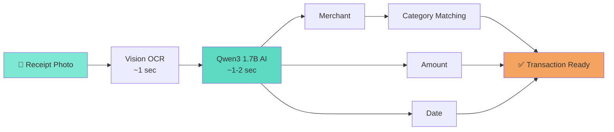

# Receipt Scanner

The fastest way to add expenses - just snap a photo and let AI do the work.

## What It Does

The receipt scanner automatically extracts transaction details from receipt photos:

- **Merchant name** - Where you spent money
- **Amount** - How much you spent
- **Date** - When the transaction occurred

All processing happens on your device - no internet required, completely private.

## How to Use

### Scanning a Receipt

1. **Tap the + button** in the app
2. **Choose "Scan Receipt"**
3. **Take a photo** of your receipt (or select from photos)
   - Ensure receipt is well-lit and in focus
   - Lay receipt flat on a surface
   - Capture the entire receipt
4. **Wait 2-3 seconds** for AI processing
5. **Review auto-filled details**
   - Merchant name
   - Amount
   - Date
6. **Edit if needed** - You have full control
7. **Tap Save**

The receipt image is saved with the transaction for your records.

### Tips for Best Results

- **Good lighting** - Natural light or bright indoor lighting
- **Flat surface** - Lay receipt flat, avoid wrinkles
- **Clear photo** - Hold steady, ensure text is readable
- **Full receipt** - Capture entire receipt in frame
- **Avoid glare** - Watch for reflections on glossy receipts

## How It Works

### AI Processing Pipeline

**Three-Stage Process:**

**Stage 1: Text Extraction (~1 second)**
- Apple Vision framework (OCR)
- Extracts all text from receipt image
- Identifies text regions and layout

**Stage 2: Smart Parsing (~1-2 seconds)**
- Qwen3 1.7B AI model analyzes text
- Identifies merchant, amount, and date
- Structures the data

**Stage 3: Category Assignment (instant)**
- Matches merchant to existing category
- Creates new category if needed
- Learns association for future use

**Total time: 2-3 seconds**

### The AI Model

Money In & Out includes a complete AI language model:

- **Model**: Qwen3 1.7B (4-bit quantized)
- **Size**: ~1 GB
- **Location**: Bundled inside the app
- **Processing**: 100% on your device
- **Privacy**: Zero data sent to cloud

This is why the app is 1.02 GB - we include the entire AI model to ensure your receipts never leave your device.

## Privacy & Security

### Your Receipts Stay Private

- **On-device processing** - All AI runs locally on your device
- **No cloud uploads** - Receipt images never sent to external servers
- **No internet required** - Works completely offline
- **Local storage** - Images stored on your device or in your iCloud
- **You control everything** - Delete receipts anytime

### What We Don't Do

- ❌ Don't upload receipts to our servers (we don't have servers)
- ❌ Don't use cloud AI services (Google, OpenAI, etc.)
- ❌ Don't analyze your spending patterns
- ❌ Don't share data with third parties
- ❌ Don't collect any data whatsoever

## Supported Receipts

### Works Best With

- ✅ Retail store receipts
- ✅ Restaurant receipts
- ✅ Gas station receipts
- ✅ Grocery store receipts
- ✅ Coffee shop receipts
- ✅ Service receipts

### May Have Issues With

- ⚠️ Handwritten receipts
- ⚠️ Faded thermal paper
- ⚠️ Crumpled or damaged receipts
- ⚠️ Receipts with heavy graphics
- ⚠️ Non-English receipts (currently)

## Accuracy

### How Accurate Is It?

Generally very accurate with clear, well-lit photos:

- **Merchant name**: 85-95% accuracy
- **Amount**: 90-98% accuracy
- **Date**: 80-90% accuracy

### Accuracy Tips

**Always review auto-filled data before saving.** The AI is very accurate but not perfect:

- Double-check amounts match your receipt
- Verify merchant name is correct
- Confirm the date is accurate
- Edit any field if needed - you have full control

## Viewing Receipt Images

### Access Saved Receipts

1. **Tap any transaction** with a receipt thumbnail
2. **Tap the receipt image** to view full-screen
3. **Pinch to zoom** for details
4. **Share or export** if needed

### Managing Receipt Images

- Receipt images are compressed to save space (max 5MB each)
- Images sync via iCloud if sync is enabled
- Delete transaction to remove receipt image
- Export transactions to save receipts externally

## Troubleshooting

### Receipt Not Scanning Well

**Problem**: AI can't extract details

**Solutions**:
- Retake photo with better lighting
- Lay receipt completely flat
- Avoid shadows and glare
- Try different angle
- Ensure receipt text is readable

### Wrong Information Extracted

**Problem**: Merchant, amount, or date is incorrect

**Solutions**:
- Edit fields manually - you have full control
- Auto-filled fields are suggestions, not final
- Review each field before saving
- If consistently wrong, contact support

### Scanner Not Available

**Problem**: Can't access receipt scanner

**Solutions**:
- Check camera permissions in Settings
- Restart the app
- Update to latest version
- Use manual entry as fallback

### Slow Processing

**Problem**: Takes longer than 2-3 seconds

**Solutions**:
- Close other apps to free memory
- Restart device if very slow
- Older devices may be slower
- Processing time varies by device

## Manual Entry Alternative

Don't want to use the scanner? No problem!

- Choose "Manual Entry" instead of "Scan Receipt"
- Enter amount and optional note
- Category is automatically assigned based on merchant
- Takes ~5 seconds
- No photo required

Both methods work equally well - use whichever you prefer.

## Technical Details

### System Requirements

- **iOS 26.0+** or **macOS 26.0+**
- ~1 GB storage for AI model
- Camera access (for taking photos)
- Photo library access (for selecting existing photos)

### Offline Capability

The receipt scanner works completely offline:

- No internet connection required
- All processing on-device
- Perfect for travel or areas with poor connectivity
- Sync happens later when online (if iCloud enabled)

### Performance

- **Processing time**: 2-3 seconds average
- **Memory usage**: ~200-300 MB during scanning
- **Battery impact**: Minimal (similar to taking a photo)
- **Storage**: Receipt images compressed to ~100-500 KB each

## Comparison: Scanner vs Manual Entry

| Feature | Receipt Scanner | Manual Entry |
|---------|----------------|--------------|
| **Speed** | 2-3 seconds + review | 5-10 seconds |
| **Accuracy** | 85-95% (with review) | 100% (you enter it) |
| **Convenience** | Just take photo | Type everything |
| **Receipt image** | Automatically saved | Can add manually |
| **Best for** | Most transactions | Quick entries, no receipt |

## Future Improvements

We're continuously improving the receipt scanner:

- Better accuracy for handwritten receipts
- Support for more languages
- Faster processing times
- Enhanced merchant recognition
- Multi-receipt batch scanning

## Next Steps

- [Learn about transactions](transactions.md)
- [Organize with categories](categories.md)
- [View analysis](analysis.md)
- [Check FAQ](../faq.md)

---

**Questions about receipt scanning?** Check the [FAQ](../faq.md) or [contact support](../support.md).
